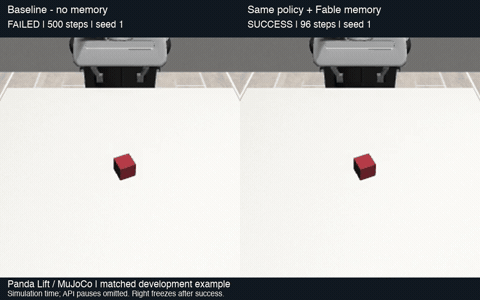
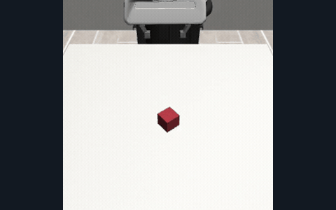
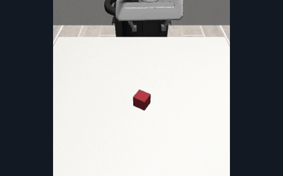
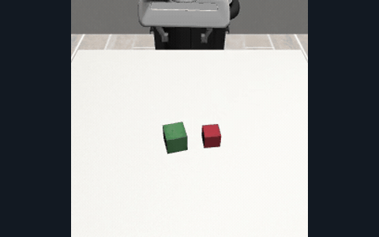
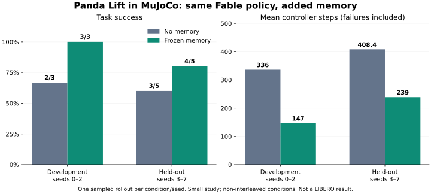
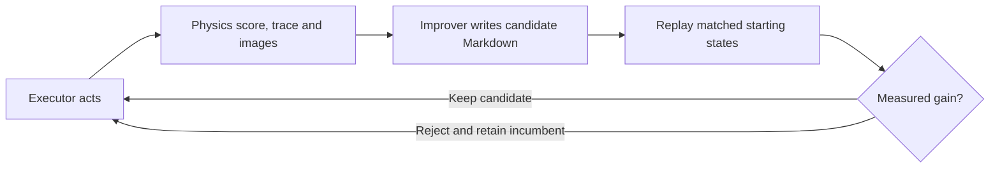

# Autoresearch for robotics

Robot agents learn reusable Markdown skills from simulation feedback. **Run → inspect failures → write a skill → replay → keep measured gains.** Built with MuJoCo, Inspect Robots, Python 3.11 and `uv`.

## Watch the robot

**[Watch the captioned demo walkthrough](docs/demos/walkthrough.mp4)** — before/after, the learned memory, and results on unseen starts.

In our small **Panda Lift** study, the same Fable 5.1 policy improved with memory from **2/3 → 3/3 development successes** and **3/5 → 4/5 on unseen seeds**. Mean held-out controller steps fell **408.4 → 239 (41% fewer)**, including failures.

| Lift · before and after, same starting state | Lift · unseen starting state, with memory |
| --- | --- |
| [](docs/demos/lift-before-after.mp4) | [](docs/demos/lift-heldout-memory.mp4) |
| Seed 1: **baseline fails at 500 steps; memory succeeds at 96**. | Seed 4: **success in 98 steps** with the frozen memory. |
| **Lift · successful baseline, no memory** | **Stack · successful baseline** |
| [](docs/demos/lift-baseline.mp4) | [](docs/demos/stack-baseline.mp4) |
| Seed 0: **success in 259 steps**. | Separate stacking task, seed 1: **success in 178 steps**. |

**Click any animation for the full MP4.** Videos show simulation time with model waiting omitted; the successful side of the comparison freezes at completion.

[Read the actual learned memory](docs/demos/lift-memory.md) · [Per-seed results and video provenance](docs/demos/results.json)

These are **Robosuite tasks in MuJoCo**, separate from our LIBERO experiments. The Lift comparison uses the same model, controller, budgets and matched starts; only the memory changes. This is a small study with one rollout per condition/seed, non-interleaved runs, and one held-out regression. Stack is a baseline demonstration. Our LIBERO stove experiment remained at 0/3 across three skill revisions.


## What changed between runs?

The model weights stay fixed. Fable writes a Markdown memory from a recorded Lift trial, and the executor receives that file on its next run.

| Observation in the earlier trial | Advice written into memory |
| --- | --- |
| Fingers closed fully, but the cube was missed. | Check measured finger positions after closing; a closed gripper alone is not a grasp. |
| Repeated forward nudges overshot the cube. | Once the cube is between the fingers, stop moving forward and descend. |
| The arm moved less than the requested distance. | Re-issue a target or correct using measured motion. |

These are the author's learned heuristics. The simulator independently decides whether the cube was lifted. [Inspect the full memory](docs/demos/lift-memory.md).



## The improvement loop



The Lift study uses Inspect Robots' native summary and memory-loading flow. The separate Python coordinator in `evaluation/loop.py` automates diagnosis, candidate generation, replay and keep/reject selection for LIBERO. Its stove candidates all tied at zero successes and were rejected. The successful Lift study and the automatic stove loop are separate experiments.


## Ownership and layout

```text
simulation/     Thomas: MuJoCo/LIBERO setup, robot tools and tests
evaluation/     benchmark runner, tests and improvement-agent instructions
docs/           setup guide and agreed design
harness/        reserved for Laksiya; she creates and owns this folder
execute/        isolated Inspect Robots agent experiment (Opus 5)
skills/         accepted Markdown skills, created when the first skill is ready
runs/           generated evidence and candidate skills; ignored
pyproject.toml  shared uv environment
uv.lock         pinned dependencies
```

See [team handoff and individual tasks](docs/HANDOFF.md): Ludvig owns robot-control
reliability in `execute/`, Laksiya owns improvement-agent quality, and Thomas owns
simulation and loop integration. Existing `harness/` work stays separate.
Evaluation and improvement work stays in `evaluation/` and consumes executor
artifacts. `evaluate.py` runs benchmarks; `improve.py` uses the Claude Agent SDK
to inspect evidence and propose a Markdown candidate in one agent session.
Development comparison selects the baseline or candidate's frozen skill snapshot.
`evaluation/loop.py` automatically replays the Inspect executor, diagnoses failures,
tests candidate skills on states 0–2 and retains only strict success-count gains.
It records the selected frozen skill path without overwriting active skills.
See [loop commands and budgets](docs/SETUP.md#automatic-inspect-skill-loop).
Inspect Robots provides optional reports from completed batches, including
original videos/stills, without taking over the executor.
The separately requested [Inspect agent experiment](execute/README.md) does use
its stock executor against a limited XYZ/gripper LIBERO adapter.

## Quick start

Run from the repository root:

```bash
uv run --no-project simulation/prepare.py
uv sync --locked
uv run -m simulation.sim tasks
uv run -m simulation.sim smoke
```

Smoke-tested on native Apple Silicon macOS and CPU-only ARM64 Linux in Docker.
Videos, camera images and traces go into ignored `runs/`. The smoke test verifies
movement/rendering; it does not solve a task.

The Python integration entry point is:

```python
from simulation.sim import Robot
```

Keep one `Robot` alive per episode and call it serially on the same thread.
See [setup and robot API](docs/SETUP.md), [agreed design](docs/DESIGN.md), and
[improvement-agent instructions](evaluation/program.md).

```bash
uv run -m evaluation.evaluate --states 0 1 --max-steps 20
uv run --group evaluation -m evaluation.evaluate --report-existing runs/my-completed-batch
uv run --group evaluation pytest -q
docker build -f simulation/Dockerfile -t autoresearch-robotics:local .
mkdir -p runs
docker run --rm -v "$PWD/runs:/app/runs" autoresearch-robotics:local
```

For the separate improvement agent, put `CLAUDE_API_KEY` in ignored `.env`:

```bash
uv sync --locked --group evaluation
uv run --group evaluation -m evaluation.improve runs/eval-smoke/state-000 --prepare-only
uv run --group evaluation -m evaluation.improve runs/eval-smoke/state-000 --kind smoke
```

Use an existing episode directory containing `result.json`; the example is our
local no-op fixture. See [evaluation setup](docs/SETUP.md#improvement-agent)
for real executor episodes, model selection and output files.

After evaluating baseline and candidate with the same recorded executor protocol:

```bash
uv run -m evaluation.evaluate --compare runs/baseline runs/candidate
```

This writes `runs/candidate/comparison.json` with `keep`, `reject` or `inconclusive`.
See [comparison setup](docs/SETUP.md#compare-skills) for the protocol and integrity checks.
