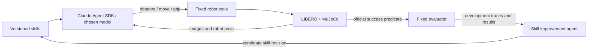

# Ten-hour MVP

## Concrete claim to test

Can the **same frozen frontier model**, using the same robot tools, solve a fixed
LIBERO task more reliably after an agent writes reusable skills from failed and
successful development episodes?

The improvement is in external skill memory/programs, not model weights. The
experiment may show no improvement; keep that outcome visible.

Start with `libero_goal`, task **0: open the middle drawer of the cabinet**.
It avoids a full pick-and-place sequence. If it is blocked after a short manual
attempt, try task **7: turn on the stove**. Task **8: put the bowl on the plate**
is the stretch task: grasp geometry makes it more demanding. Freeze the selected
task before collecting the baseline.

## Definition of done

1. Reset a real LIBERO scene, render both cameras and physically move the arm.
2. A Claude SDK session performs at least one task attempt through robot tools.
3. Capture baseline episodes with **no skills**, including failures and video.
4. An outer agent inspects development evidence and writes one candidate skill.
5. Evaluate the candidate on the same development states; keep or reject it.
6. Freeze the chosen skill and run both conditions on untouched held-out states.
7. Show a before/after video, exact success counts, and the skill diff. Never
   substitute a scripted rollout for an agent rollout in the claimed comparison.

Infrastructure already prepared here: step 1, motion tools and fixed-state
evaluation. Claude SDK wiring, model access, successful manipulation, skill
generation and the before/after experiment remain team work.

## Work split and schedule

Thomas owns `simulation/`. Laksiya creates and owns `harness/`; the loop/API
notes below are a proposal, not a restriction on her harness implementation.

| Elapsed | Thomas: simulator/evaluation | Laksiya: agent/skills |
| --- | --- | --- |
| 0–1 h | Run smoke; inspect cameras; verify chosen task | Verify available model and SDK authentication; wrap observe/move/grip |
| 1–2 h | Test approach, contact, gripper and retreat manually | One complete observe → tool → image feedback cycle; log tool calls |
| 2–4 h | Freeze task, tools, step cap and state split | Get one agent attempt working; collect no-skills development baseline |
| 4–6 h | Inspect failures and validate that scoring is unchanged | Outer agent writes a single skill, runs candidate, keeps/rejects |
| 6–8 h | Run held-out evaluation and preserve artifacts | Freeze skill; fresh sessions; collect model/cost metadata |
| 8–10 h | Pick representative videos and prepare result table | Demo rehearsal, short explanation of loop, contingency recording |

Recommended small budget: development states `0 1 2`; held-out states `3 4 5 6 7`.
All episodes use `seed=0`, task order 0, 500 control steps and identical tool APIs.
Suggested SDK limits: 40 model/tool turns, 5 minutes per episode, a team-chosen
cost cap. Test whether those fit observed latency before freezing the protocol.
Three candidate revisions is enough to demonstrate a real keep/reject loop.
Choose candidates only on development results. Compare final baseline/candidate
on the same five held-out states once; do not tune from those failures. Five
states are a hackathon demonstration, not evidence of broad generalization.

## Low-hanging fruit and cut lines

- Use Cartesian waypoints and gripper commands; MuJoCo/OSC handles motor control.
- Feed both external and wrist camera images back after each tool call.
- Learn concrete recovery rules: approach clearance, grasp alignment, contact
  verification, retry direction, when to reopen the gripper. Bind every rule to
  evidence; avoid a generic motivational prompt masquerading as a skill.
- For SDK integration/debugging, object coordinates can be exposed with
  `--privileged`. If needed for the demo, run both conditions that way and clearly
  call it a **state-assisted** experiment. Do not mix observation modes.
- If the agent cannot act by hour 3, focus on one successful fixed-state attempt.
  If the outer loop is not automated by hour 6, show one transparent human-triggered
  skill revision cycle and state that limitation. Don't build a dashboard first.
- Skip RL, VLA training, full LIBERO-100, multi-robot support, browser 3D UI,
  remote simulator services, vectorized environments and a skill database for now.

Fable/Opus is configurable in Laksiya's adapter. Verify access in the hackathon
account; do not make the simulator depend on one model identifier. Keep the
acting model constant for the skills ablation. A stronger model can be the outer
skill author if recorded as part of the experiment.

## Adjacent work worth borrowing from

| Reference | Relevant idea | MVP use |
| --- | --- | --- |
| [Karpathy autoresearch](https://github.com/karpathy/autoresearch) | Fixed evaluator, bounded experiments, keep/reject loop | Agent changes skills only; evaluator/tools remain fixed |
| [VIA code](https://github.com/hengyuan-hu/via) / [paper](https://arxiv.org/abs/2607.11119) | Frontier agents drive robot waypoints through visual tools; includes LIBERO tasks | Inspect tool descriptions and visual feedback. Rebuilding its 3D UI is outside our initial scope |
| [ASPIRE](https://research.nvidia.com/labs/gear/aspire/) / [paper](https://arxiv.org/abs/2607.00272) | Agent discovery and iterative refinement of reusable robot skills | Closest research framing for the outer loop; acknowledge prior work |
| [FAEA code](https://github.com/robiemusketeer/faea-sim) / [paper](https://arxiv.org/abs/2601.20334) | Claude Agent SDK applied to simulated manipulation with privileged state | Concrete integration reference, especially for state-assisted fallback |
| [Official LIBERO](https://github.com/Lifelong-Robot-Learning/LIBERO) | Task definitions, initial states, sparse success predicate | Use as the environment and scoring source |

VIA reports strong results on a selected three-task LIBERO-Goal subset; that is
not a full-suite result or a guarantee for our simpler interface. ASPIRE means
“self-improving robot skills” is not itself a novel research claim. Our useful
hackathon deliverable is a small reproducible agent loop and honest ablation.

The supplied [X post](https://x.com/AGTPinsights/status/2098520186336825571) was
inaccessible to the research fetch (403), so its exact claim has not been verified.
The references above were inspected independently, not assumed to be that post.
